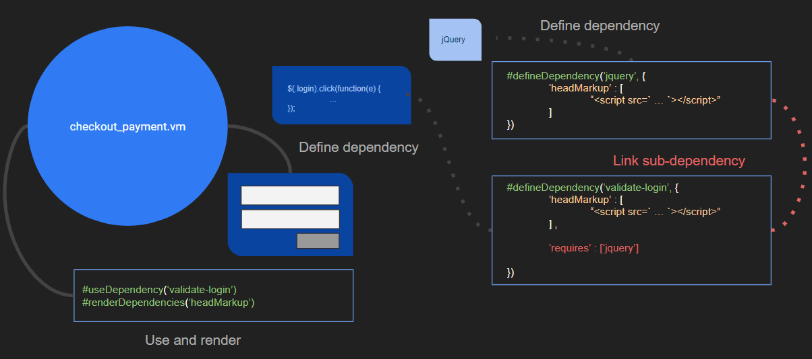

# Flex

## About

This tutorial walks through all aspects of the 'Flex' codebase. We start by comparing and contrasting general architecture against our legacy code base. Afterwords, we deep dive into the core functionality of Flex, explore modular design patterns, ...

## 1.0: Termonology and General Architecture:

* **C8**
    Avetti's Commerce-8 platform: a multi-vendor ecommerce platform.
* **cluster**: 
    * a cluster denotes a logical grouping of EC2 instances (virtual servers) comprising staging (preview) and production (shop) environments. C3 denotes *cluster 3* and the staging/preview environment is ggc8admin3.avetti.ca and the production/shop environment is ggc8prod3.avetti.ca
    * Backend-driven: 
        * API built on Java/Spring. 
        * Velocity (Java-based templating engine) renders VTL templates into markup server-side, which is returned as an HTTP response
        * Templates and shop-specific data stored in MySQL database. We interface with templates via Avetti's built-in template editor, or through a Sublime plugin which abstracts away the underlying template data stored in MySQL.
        * NGINX is used as a reverse-proxy, allowing clients to interface with backend API, and for serving static content (images, stylesheets), and handles domain mapping.
* **shop**
    * A discrete site containing it's own set of velocity templates, configuration, and static files
    * Each shop has a corrosponding Vendor ID (vid)
    * On C8, a shop's static files are located in the directory: /avetti/httpd/htdocs/content/preview/store/{vid}
    * css files are stored in ../{vid}/assets/themes/blaze_en/css"
* **Master Template Library (MTL)**
    * A shop on each cluster which acts as a central responsitory for velocity templates Globally scoped, templates and methods leveraged by all shops on a cluster.

## Navigating Stores

When logged into the admin console, on either the preview or production instances, you'll be presented with a list of shops, and their corresponding store id (vid), website name, and url. Clicking on a store id will bring you to setup for the respective store.

## Shop configuration

### categories

### admin preferences

### site preferences

### store properties

### order preferences

### payment gateways

### email settings

### shipping

### publishing


## 2.0 Flex MTL:

### About
* Coined *Flex* after the CSS layout, *Flexbox*. For Clients, Sales Reps and Program managers, this distinguishes the fact that our sites are responsive and mobile friendly. Bottom line: provide the best possible customer experience that's as simple and smooth as possible, end-to-end. 
* Development began a couple of years back. As of 2020, all new sites are developed on C3.
* Flex employs modular design patterns (components, dependencies and partials)
* Syntatically Awesome Stylesheets (SASS) is used on all Flex sites.

### Architecture

The Flex MTL codebase is seperated into two parts: velocity templates, and skeleton library

### velocity:

There are three core elements supporting modularity on Flex, each of which provide a layer of abstraction over underlying static velocity templates:

---
#### partials

Velocity provides the macro #parse, which allows us to parse in a named template, directly. Use `#parse("template_name.vm")` when parsing templates stored in the MTL, and `#parse("/$vendorSettingsDTO.vendorId/$vendorSettingsDTO.themeId/template_name.vm")` when parsing templates, local to your shop.

Building on top of the `#parse()` macro, **partials** are used to help de-couple template parsing. Take for example the category.vm template for a shop on C1 or C2: this template parses in an MTL template responsible for rendering category items, by calling `#parse("libpartCategoryProductList.vm")`. If you wishe to modify functionality within libpartCategoryProductList.vm, without affecting other shops on the cluster, you'll need to comment out that #parse, and replace it with the *contents of*  libpartCategoryProductList.vm -- 

For a Flex site, within category.vm, we're also relying upon an MTL template to extend to our category.vm template the ability to render category items; however, we're calling `#renderPartials('category-content')` instead. When this macro is rendered, if local template `/$vendorSettingsDTO.vendorId/$vendorSettingsDTO.themeId/category-content.vm` was found when the partial was *initialized* when calling `#usePartials('category-content')` at the top of the template, than the content of that local template is rendered. If a local version was not found, than the global template `lib_category-content.vm` would be rendered. An error will offer when `#usePartials(partial_name)` is called, if neither an MTL nor local version exists. This general pattern allows us to create an alias for templates, and helps to keep things modular.


-> The MTL template `lib_macros_partials.vm` contains the code responsible for using and rendering partials. Open this template to explore the underlying mechanics if desired!

---
#### dependencies

Making use of dependency patterns allows us to break coherent functionality off into it's own discrete ‘contract’, leading to code that is easier to manage, test, and re-use.

 

#### Defining, Using, and Rendering Dependencies

**Define a dependency**:

```
#defineDependency(‘my-dependency’, {
	‘headMarkup’ : [
		“<script src=’...’></script>”,
“/$vendorSettingsDTO.vendorId/$vendorSettingsDTO.themeId/js_template.vm”,
] ,
	‘footMarkup’ : [
		“Asset_1”,
		“Asset_2”,
		     ...
		“Asset_n”
		] ,

‘requires’ : [‘jquery’, ‘dep_2’, … ‘dep_n’]

})
```
The #defineDependency macro is passed a dependency name, and a hashmap which may contain section-name/static-asset pairs along with a list of sub-dependencies required. Above, ‘headMarkup’ maps to a list containing a script and a local template. 

**Use and render**:
```
#useDependency(‘my-dependency’)
#renderDependencies(‘headMarkup’)
```
The useDependency macro flags a dependency as being used. Will render out any dependency sections, if renderDependencies(sectionName) is called.

**Dependencies in action**:

 

-> The MTL template `lib_macros_dependencies.vm` contains the code responsible for using and rendering dependencies. Open this template to explore the underlying mechanics if desired!

---
#### components

lib_macros_components

### skeleton library:


				
## 3.0: Flex Store

### Parsing templates, directly

### Using partials

### Using dependencies

### using components

### Stylesheets


